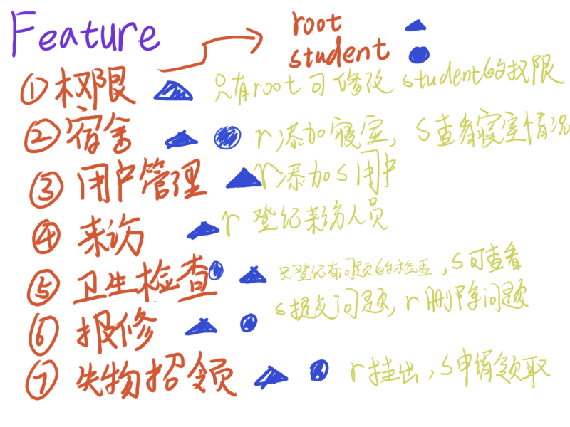
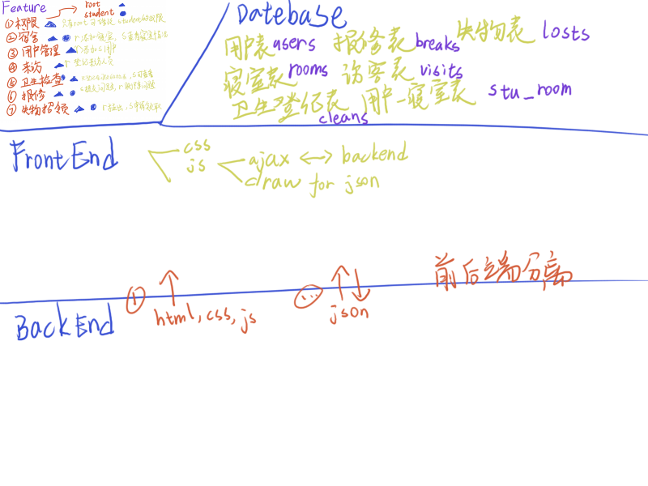

# 学生宿舍管理系统

## 总览

大概功能：

分工（一个人分工：

## 数据表

> 使用 sqlite3

- [ ] users（增，删，改，查

| 字段名   | 值           | 说明   |
| -------- | ------------ | ------ |
| id       | int          |        |
| name     | varchar(128) | 姓名   |
| username | varchar(255) | 用户名 |
| password | varchar(255) | 密码   |
| power    | int          | 权限   |

- [ ] rooms（增，删，改，查

| 字段名    | 值           | 说明     |
| --------- | ------------ | -------- |
| id        | int          |          |
| room_name | varchar(255) | 寝室号   |
| score     | double       | 寝室积分 |

- [ ] cleans（增，改，查

| 字段名  | 值     | 说明         |
| ------- | ------ | ------------ |
| id      | int    |              |
| room_id | int    | 寝室号       |
| when    | time   | 处理时间     |
| desc    | string | 具体什么原因 |
| points  | double | 改多少分     |

- [ ] breaks（增，改，查

| 字段名    | 值     | 说明         |
| --------- | ------ | ------------ |
| id        | int    |              |
| poster_id | int    | 上报者id     |
| desc      | string | 具体什么坏了 |
| status    | int    | 维修状态     |
| post_time | time   | 上报时间     |

- [ ] visits（增，改，查

| 字段名      | 值           | 说明                           |
| ----------- | ------------ | ------------------------------ |
| id          | int          |                                |
| who         | varchar(255) | 访问者姓名                     |
| when_arrive | time?        | 到达时间                       |
| is_leave    | boolean      | 是否离开，0表示到达，1表示离开 |
| why         | string       | 到访理由                       |
| when_leave  | time         | 离开时间                       |

- [ ] losts（增，改，查

| 字段名    | 值           | 说明       |
| --------- | ------------ | ---------- |
| id        | int          |            |
| when      | time         | 上报时间   |
| what      | varchar(255) | 物品名称   |
| link      | varchar(255) | 图片链接   |
| picked    | boolean      | 是否被取走 |
| picker_id | int          | 取走者id   |

- [ ] stu_room（增，删，改，查

| 字段名  | 值   | 说明     |
| ------- | ---- | -------- |
| id      | int  |          |
| user_id | int  | 用户外键 |
| room_id | int  | 寝室外键 |

## 前端

> 使用 Ajax 和 js 处理前端元素？
>
> 总共八个大页面，大页面之间用 html 加载，页面内用 json 前后端分离
>
> 1. 登录 `login.html`
> 2. 权限管理 `power.html`
> 3. 用户管理 `user.html`
> 4. 宿舍管理 `room.html`
> 5. 来访登记 `visit.html`
> 6. 卫生检查 `clean.html`
> 7. 寝室报修 `break.html`
> 8. 失物招领 `lost.html`

用户不能注册，只能通过管理员添加用户

## 后端

> 使用 go 的 gin + gorm 框架

## api 接口

> \* 号为必做

| 状态     | 方法 | 路由 | 发送 | 返回 |
| -------- | ---- | ---- | -------- | ---- |
| * | GET | `/login` |  | login.html |
| * | POST | `/login` | json{username: string, password: string} | json{status: 失败0/成功1, token: 字符串} |
|  | GET | `/power` |  | power.html |
|  | POST | `/power/modify` | json{user_id: int, change_to: int} | json{status: 失败0/成功1} |
|  | GET | `/user` |  | user.html |
| | POST | `/user/add` | |  |
| | POST | `/user/del` | |  |
| * | GET | `/room` |  | room.html |
| * | POST | `/room/query` | |  |
| * | POST | `/room/add` | |  |
| * | POST | `/room/del` | |  |
|  | GET | `/visit` |  | visit.html |
| | POST | `/visit/query` | |  |
| | POST | `/visit/add` | |  |
| | POST | `/visit/modify` | |  |
|  | GET | `/clean` |  | clean.html |
| | POST | `/clean/add` | |  |
|  | GET | `/break` |  | break.html |
| | POST | `/break/add` | |  |
| | POST | `/break/query` | |  |
| | POST | `/break/modify` | |  |

